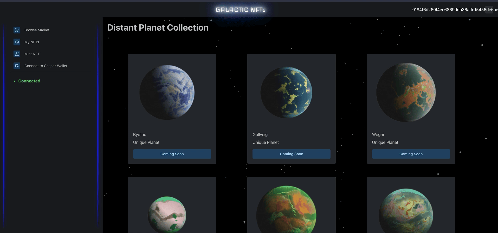

# Casper-NFT-Marketplace



## Description
Built for the Ready Player Casper Hackathon.

Currently work in progress, an NFT Store to participate in the Casper Network.
_Note: The rust contract is not complete and some of the data in the front end is using sample data only._ 

### Design Summary
Using Next.js for marketplace users to interact with. 
A rust Market contract to interact with the Casper CEP47 protocol.
Supabase db for tracking relevant market items.


## Implemented
- Browse page with static data
- Connect to wallet
- My NFTs page which will fetch from supabase database, (Planning to sync with Casper to verify ownership.)
- Mint NFT form for creating an nft(Incomplete)
- Partial market contract implementation - see below for remaining functionality required

## Instructions

```
cd front-end
npm i
npm start dev
```

## TODO
### Front end
- Deploy front end
- Link front end with cep47 contract
- Link front end with market contract
- Implement minting page

### CEP47 compatible market contract
- Currently work in progress, basic structure created, needs work to implement desired functionality git 
- Tests ensuring secure transactions
- Functionality - Changing ownership of nft
- Functionality - Adding payments
- Functionality - Merge approve transaction into create item
- Functionality - Add quantity to nft
- Code quality - Change market item to struct

### Wishlist
- Create collections
- Upload meta to online buckets instead of asking for url in mint page
