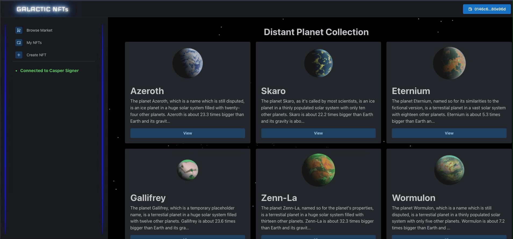
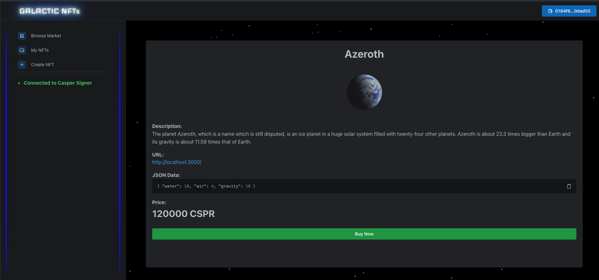
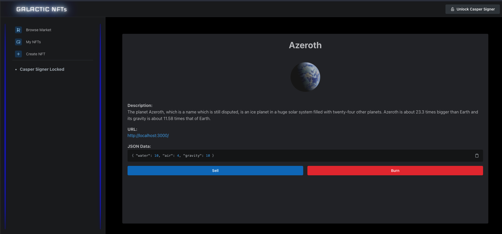
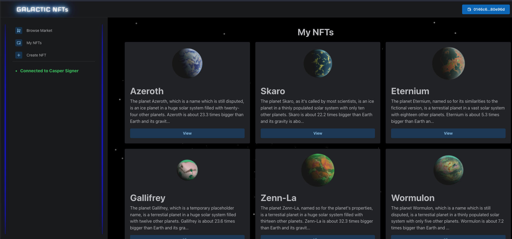
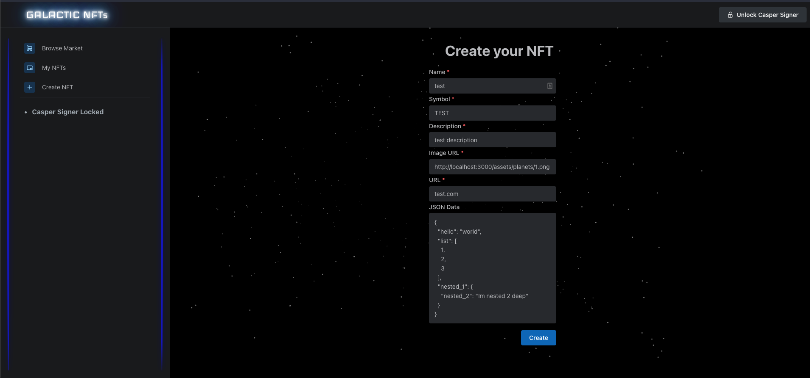

# Casper-NFT-Marketplace


## Browse



## Description

Built for the Ready Player Casper Hackathon. Currently, work in progress, an NFT Store to participate in the Casper Network.

**Please note this has not been audited or peer reviewed, and is not ready for production.**

### Design Summary

Using Next.js for marketplace users to interact with. A rust Market contract to interact with the Casper CEP47 protocol.

## Implemented

- Browse page with static data
- Connect to wallet
- Mint NFT
- View owned NFTs
- View all NFTs
- View NFT Detail including meta, image and price
- Partial market contract implementation - see below for remaining functionality required


## TODO

### Front end

~~- Deploy front end~~
~~- Implement minting page~~
- Link front end with cep47 contract(Some functionality still wip)
- Link front end with market contract

### CEP47 compatible market contract

~~- Functionality - Changing ownership of nft~~
- Functionality - Creating market item for sale
- Functionality - Processing sale of market item
- Security - Ensuring no loopholes in logic
- Error Handling - Provide correct errors within Contract
- Tests around securing transactions
- Functionality - Adding payments
- Functionality - Add quantity to nft

### Wishlist

- Create collections
- Upload meta to online buckets instead of asking for url in mint page
- Transaction history on NFT detail page
- Code improvement - Change market item to struct


## Instructions

### Deploying Contracts

```
cd casper-contracts-js-client
cp ..env.cep47.example .env.cep47
npm i

# Take note of Contract Hash and Contract Package Hash for adding to server .env.local
npm run e2e:cep47:install

Optional - for some mock nfts:
e2e:cep47:fixture
```


### Launching Server
```
cd server
cp .env.template .env.local
npm i
npm start dev
```

## Screenshots

## Detail Buy


## Detail Sell


## My NFTs


## Create NFT

