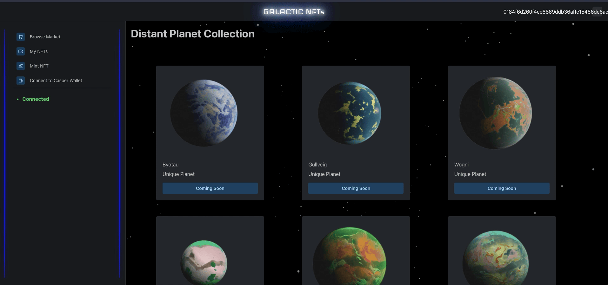

# Casper-NFT-Marketplace

## Description
Currently work in progress, the rust contract is not complete and front end is using static data only using Nextjs. 

##TODO
### Front end
- Deploy front end
- Link front end with wallet
- Link front end with market contract
- Create minting page
- Create collections

### CEP47 compatible market contract
- Currently work in progress, basic structure created, needs work to implement desired functionality git 
- Tests ensuring secure transactions
- Functionality - Changing ownership of nft
- Functionality - Adding payments
- Functionality - Merge approve transaction into create item
- Functionality - Add quantity to nft
- Code quality - Change market item to struct
